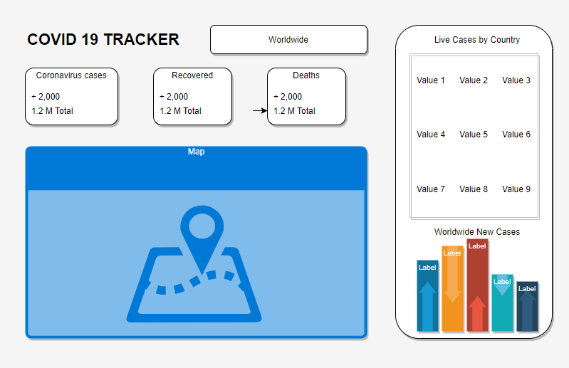

# Covid Tracker

## Web Application

Responsive web application that show live statistics of corona virus cases worldwide.

---

## Tools

- [Visual Studio Code](https://code.visualstudio.com/) - IDE
- [React.js](https://reactjs.org/docs/hello-world.html) - Front end
  - [Material UI](https://material-ui.com/)
  - [React-chartjs-2](https://github.com/reactchartjs/react-chartjs-2)
- [Firebase](https://firebase.google.com/) - deployment

---

## Wireframe

---

## Versions

- Node - v14.14.0

---

## Pages

---

### Resources

- [disease.sh](https://disease.sh/) - API call for live cases
